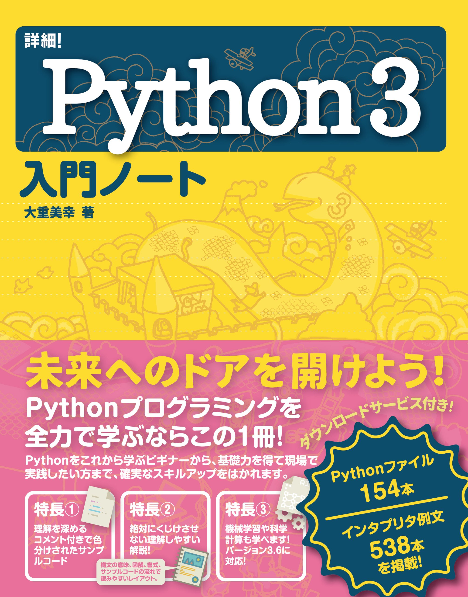

# 24年前期 プログラミングⅡ

 

## 1. 授業計画

- 第01回 ガイダンス ※登録調整期間
- 第02回 基本文法の復習1
- 第03回 基本文法の復習2
- 第04回 辞書
- 第05回 ユーザ定義関数
- 第06回 他のPythonファイルの関数を使う
- 第07回 関数の高度な利用、クラス定義
- 第08回 中間試験
- 第09回 クラスの継承、プロパティの利用
- 第10回 テキストファイルの読み込み、書き出し
- 第11回 グラフ
- 第12回 Numpy
- 第13回 機械学習（分類モデル）
- 第14回 機械学習（回帰モデル）
- 第15回 期末試験対策
- 第16回 期末試験

 

## 2. テキスト・参考文献・資料など

[教科書「Python3入門ノート」（大重美幸、ソーテック社) ](https://www.amazon.co.jp/dp/4800711673/)  
[サンプルコードはココ](http://www.sotechsha.co.jp/sp/1167/)

 
